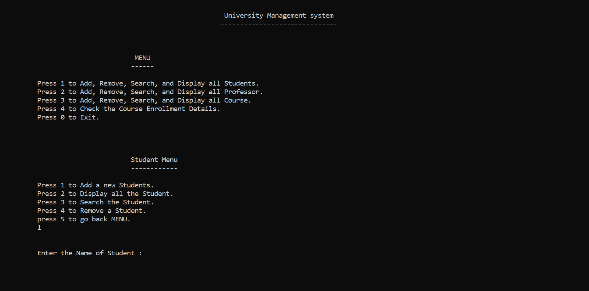

### **<h1 align="center">📌 University Management System</h1>**

## **📖 About the Project**
University Management System in C++ to add, remove, search, and display students, professors, and courses. It also allows checking course enrollment details using Object-Oriented Programming (OOP) concepts such as abstraction, inheritance, and polymorphism. Additionally, it implements relationships like association and aggregation, providing a user-friendly command-line interface (CLI).

## **🚀 Features**
- **Add, Remove, Search, and Display the Objects**  
- **Object-Oriented Programming (OOP) concepts**  
- **User-Friendly CLI**

## **📜 Language used**
- **C++**

## **📸 Screenshots**
**
User-Friendly CLI
**

## **Author**
🔗 GitHub: [Umer Farooq Jillani](https://github.com/UmerFarooqJillani)

---
